---
## Front matter
lang: ru-RU
title: "Внешний курс. Блок 1"
author:
  - Неустроева И.Н.
institute:
  - Российский университет дружбы народов, Москва, Россия
## i18n babel
babel-lang: russian
babel-otherlangs: english

## Formatting pdf
toc: false
toc-title: Содержание
slide_level: 2
aspectratio: 169
section-titles: true
theme: metropolis
header-includes:
 - \metroset{progressbar=frametitle,sectionpage=progressbar,numbering=fraction}
 - '\makeatletter'
 - '\beamer@ignorenonframefalse'
 - '\makeatother'
 
 ## Fonts
mainfont: PT Serif
romanfont: PT Serif
sansfont: PT Sans
monofont: PT Mono
mainfontoptions: Ligatures=TeX
romanfontoptions: Ligatures=TeX
sansfontoptions: Ligatures=TeX,Scale=MatchLowercase
monofontoptions: Scale=MatchLowercase,Scale=0.9
 
---

# Информация

## Докладчик

:::::::::::::: {.columns align=center}
::: {.column width="70%"}

  * Неустроева Ирина Николаевна
  * студентка группы НБИ 02-23
  * Российский университет дружбы народов
:::
::::::::::::::

## Преподаватель

:::::::::::::: {.columns align=center}
::: {.column width="70%"}

  * Кулябов Дмитрий Сергеевич
  * д.ф.-м.н., профессор
  * профессор кафедры прикладной информатики и теории вероятностей
  * Российский университет дружбы народов
:::
::::::::::::::

# Вводная часть

## Цели и задачи

Выполненить контрольные задания первого блока "Безопасность в сети" внешнего курса "Основы кибербезопасности".

## Материалы и методы

Интернет-ресурсы

# Основная часть 

## Как работает интернет: базовые сетевые протоколы Вопрос 2.1.1 

Протокол HTTP(S) протокол прикладного уровня, ответ на вопрос 1 - HTTPS

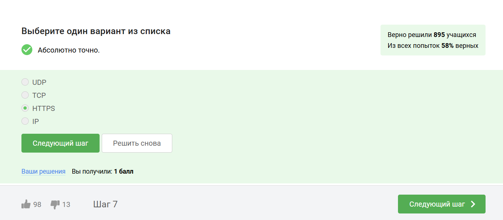

## Вопрос 2.1.2

На транспортном уровне существует два примера протокола: первый - это TCP, в честь которого названа модель.

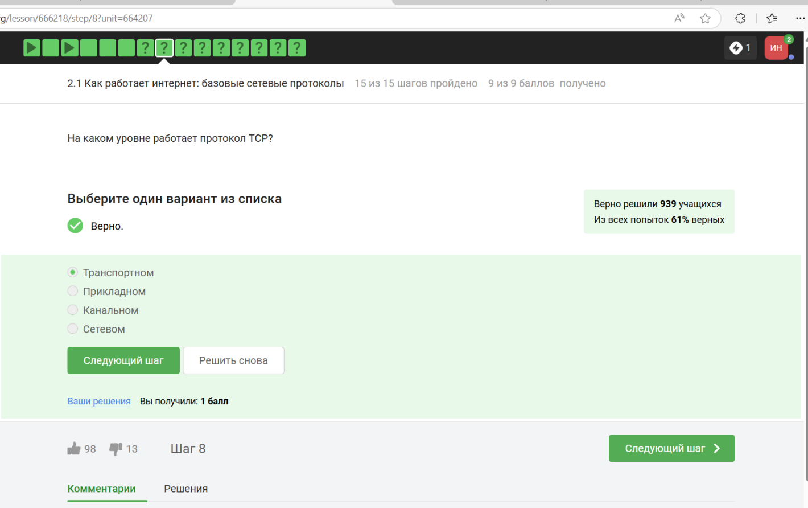

## Вопрос 2.1.3

Т.к адрес состоит из большего набора чисел, а именно это 4 или 6 цифер от 0 до 255. В двух вариантах встречаются цифры больше 255, что неверно

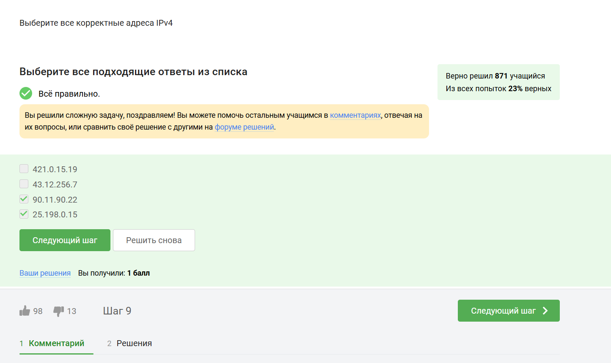

## Вопрос 2.1.4

Основная задача DNC это сопоставлять название ( доменное имя, с корекстым IP-адресом) с тем, где лежит этот сервер, этот сайт

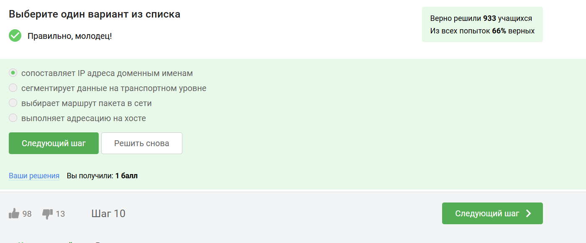

## [Вопрос 2.1.5

Классификация протоколов в модели TCP/IP:

- Прикладной уровень: HTTP, RTSP, FTP, DNS.

- Транспортный уровень: TCP, UDP, SCTP, DCCP.

- Сетевой  уровень: IP.

- Уровень сетевого доступа (Канальный) (Link Layer): Ethernet, IEEE 802.11, WLAN, SLIP, Token Ring, ATM и MPLS

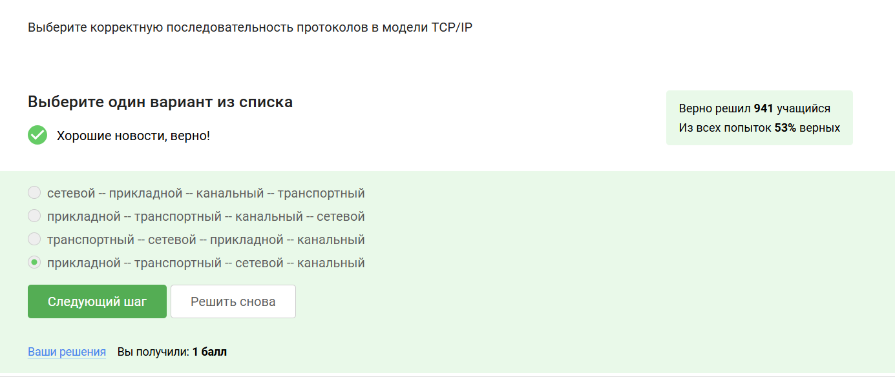

## Вопрос 2.1.6

Протокол http передает не зашифрованные данные, а протокол https уже будет передавать зашифрованные данные

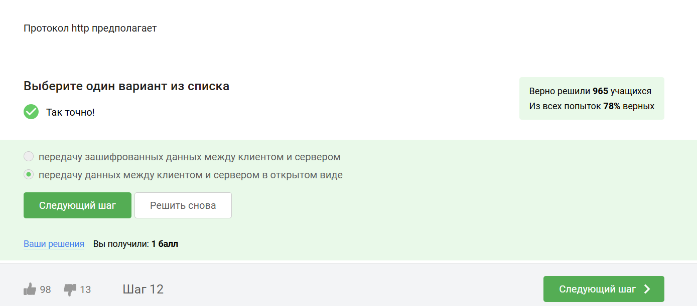

## Вопрос 2.1.7

https передает зашифрованные данные, поэтому одна из фаз это передача данных, другая должна быть рукопожатием

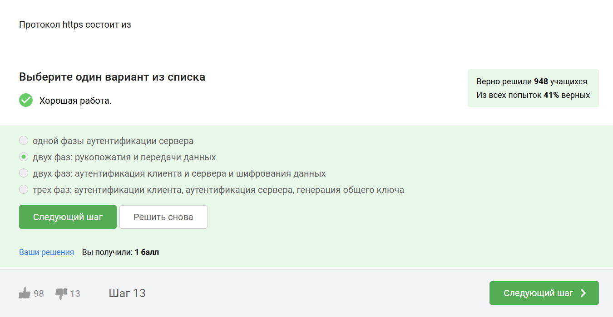

## Вопрос 2.1.8

TLS определяется клиентом и сервером, чтобы возможно было подключиться

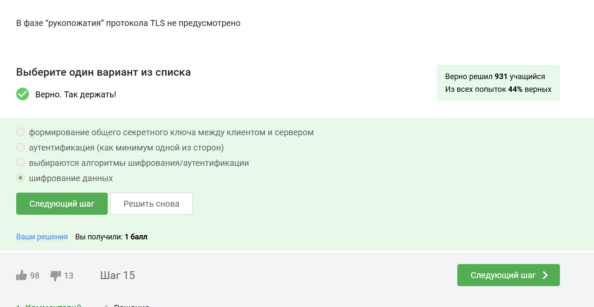

##  Вопрос 2.1.9

Фаза рукопожатия вкючает в себя: 

- выбор параметров, протоколов
- аутентификация (как минимум, сервера)
- формируется общий секретный ключ K 

Следовательно вариант с шифрованием лишний

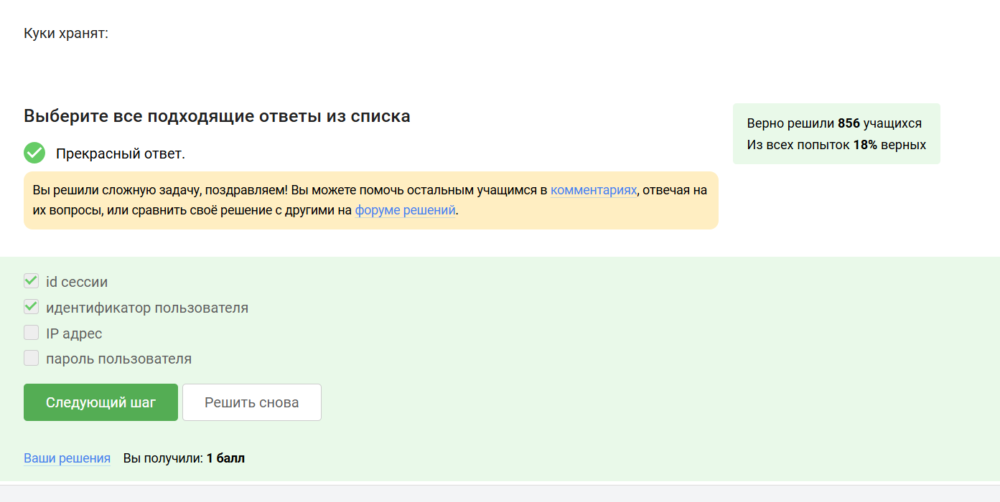

## Персонализация сети Вопрос 2.2.1

Куки хранят в себе список параметров и их значений. Этими параметрами могут быть id пользователя, id сессии, тип браузера и некоторые действия пользователей 

## Вопрос 2.2.2

Куки не делают соединение надежным

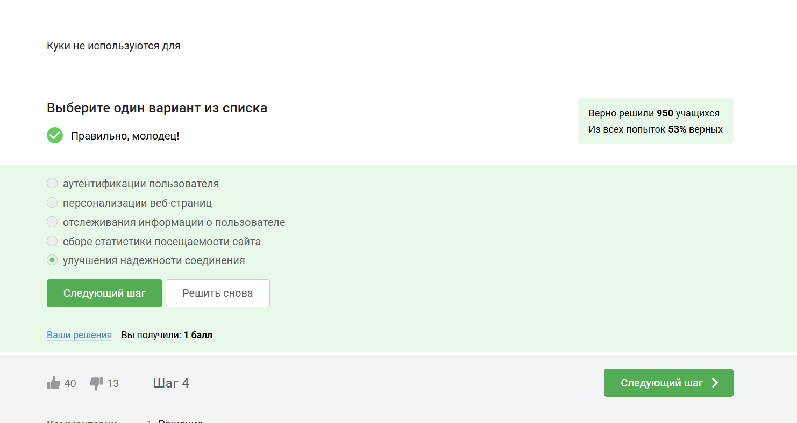

## Вопрос 2.2.3

Куки генерируются сервером

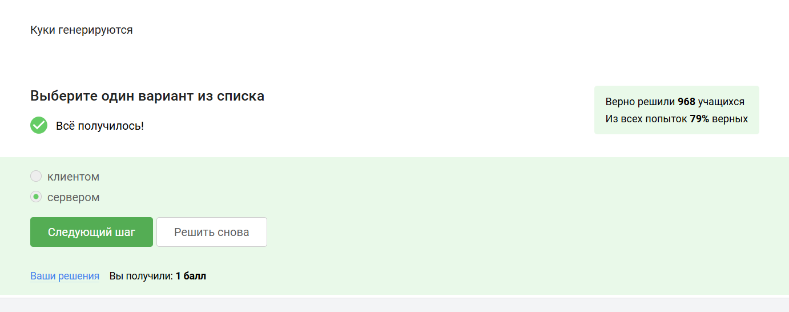

## Вопрос 2.2.4

Куки бывают сессионные, удаляются при закрытии окна браузера

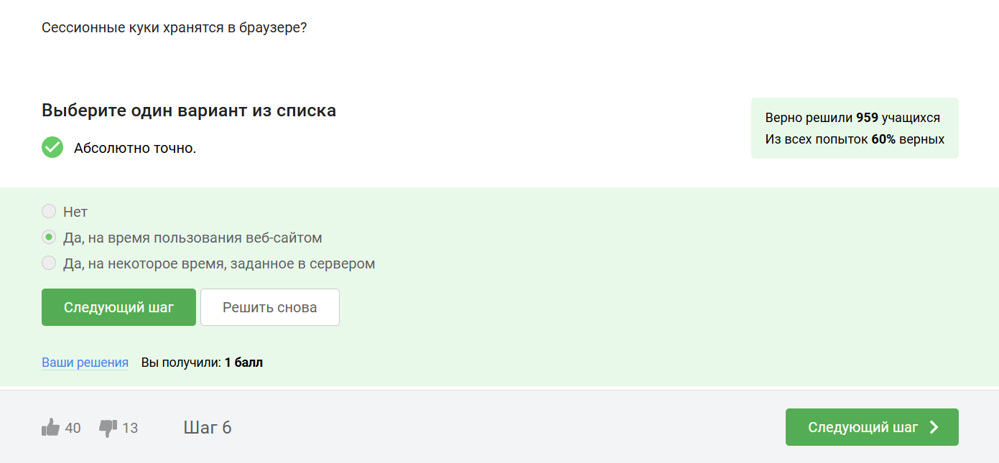

## Браузер TOR. Анонимизация Вопрос 2.3.1

В луковой модели маршрутизации у нас тоже есть узлы. Они разделяются на охранный узел, промежуточный и выходной. В браузере Tor всегда есть три роутера, их не больше и не меньше

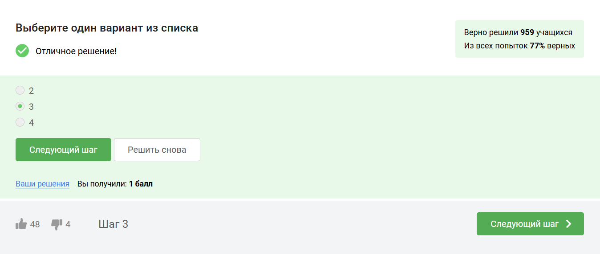

##  Вопрос 2.3.2

IP-адрес не должен быть известен охранному и промежуточному узлам

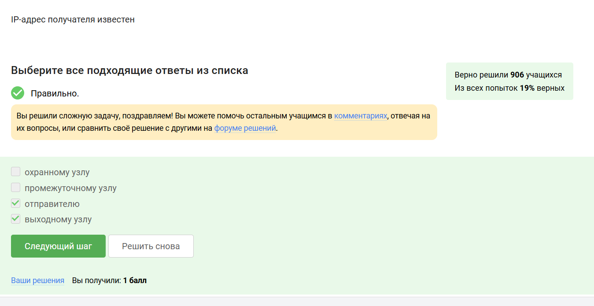

##  Вопрос 2.3.3

В анонимных сетях, таких как Tor, общий секретный ключ для сквозного шифрования требует участия всех трех типов узлов: охранного, промежуточного и выходного. Охранный узел сам по себе не обеспечивает генерацию ключа. Каждый узел вносит свой вклад в криптографический протокол (например, Diffie-Hellman), обеспечивая анонимность и защиту от перехвата.

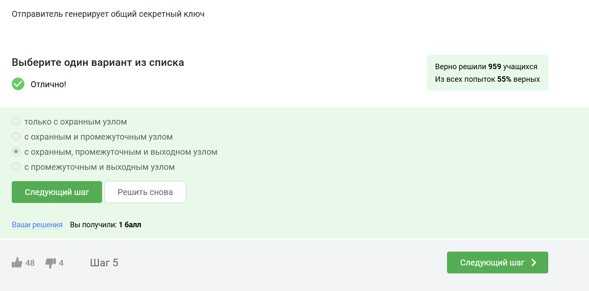

##  Вопрос 2.3.4

Для получения пакетов не нужно использовать TOR. TOR — это технология, которая позволяет с некоторым успехом скрыть личность человека в интернете

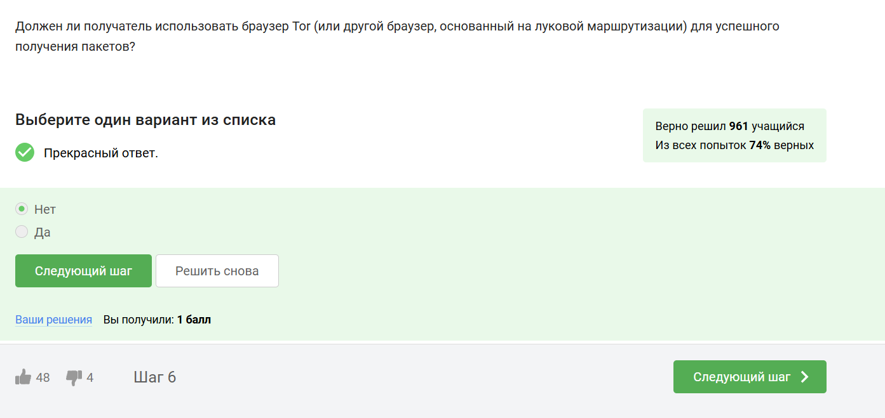

## Беспроводные сети Wi-fi Вопрос 2.4.1

WiFi - это технология беспроводной локальной сети, она основана на стандарте IEEE 802.11

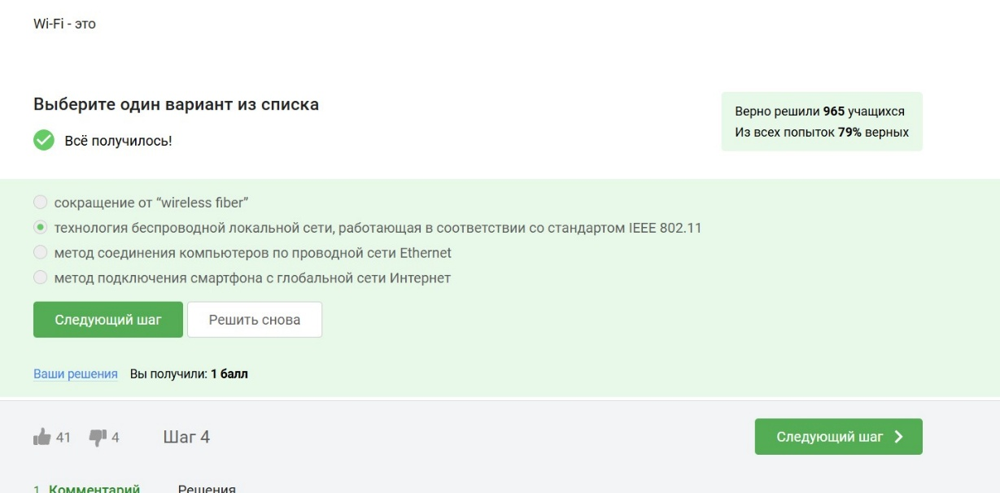

## Вопрос 2.4.1

WiFi работает на самом нижнем канальном уровне

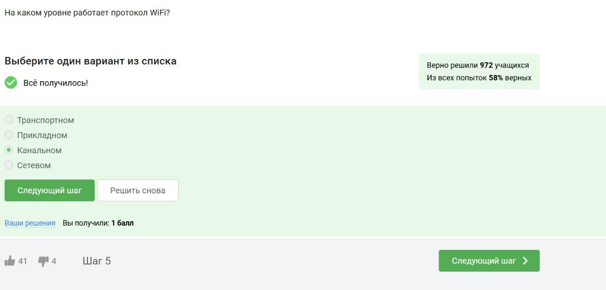

## Вопрос 2.4.1

WEP - устаревший и небезопасный метод шифрования WiFi из-за короткой длины ключа (40 бит), что делает его легко взламываемым. Использовать WEP категорически не рекомендуется

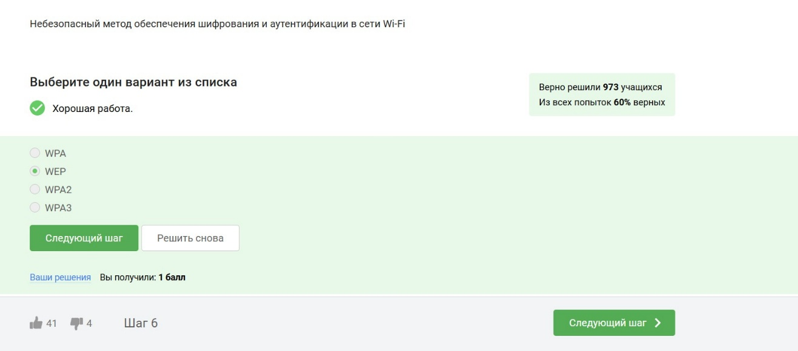

## Вопрос 2.4.1

Безопасность WiFi подразумевает защиту передачи данных между устройством (телефон, компьютер) и роутером (подключенным к интернету), осуществляемую с помощью шифрования и аутентификации

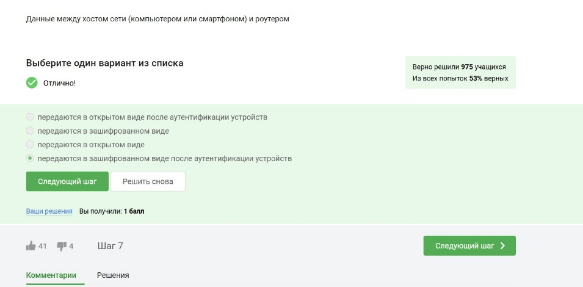

## Вопрос 2.4.1

WPA2 Personal предназначен для домашнего использования, а WPA2 Enterprise - для коммерческих организаций.

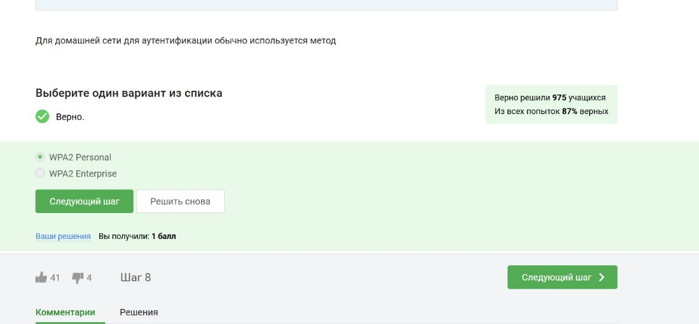

# Вывод

В результате выполнения блока "Безопасность в сети" я узнала, как работают сетевые пратаколы, куки-файлы, сети вайфай и для чего нужен браузер Tor.

:::
