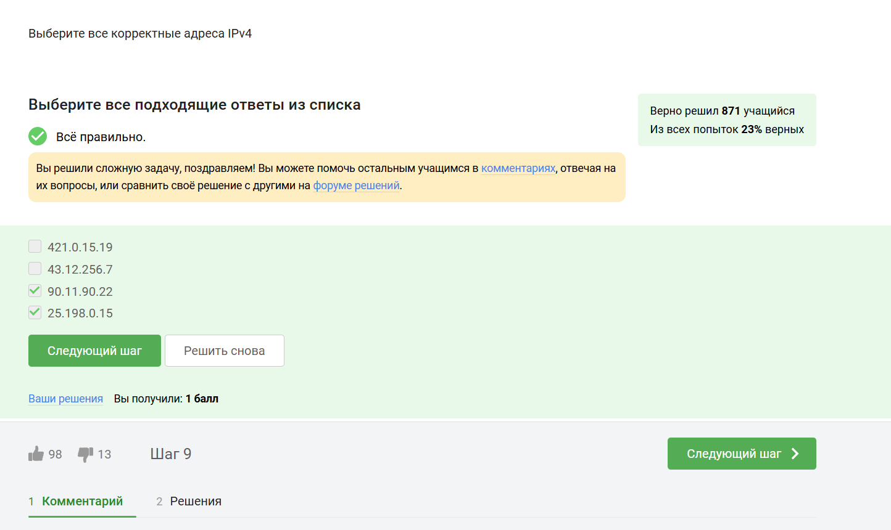
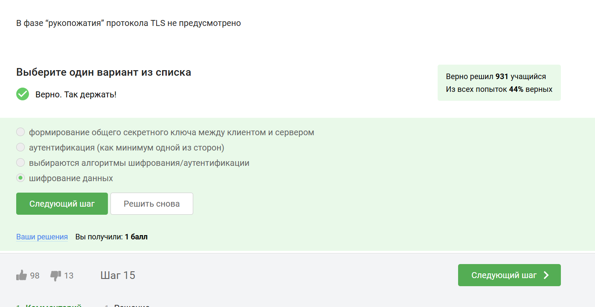
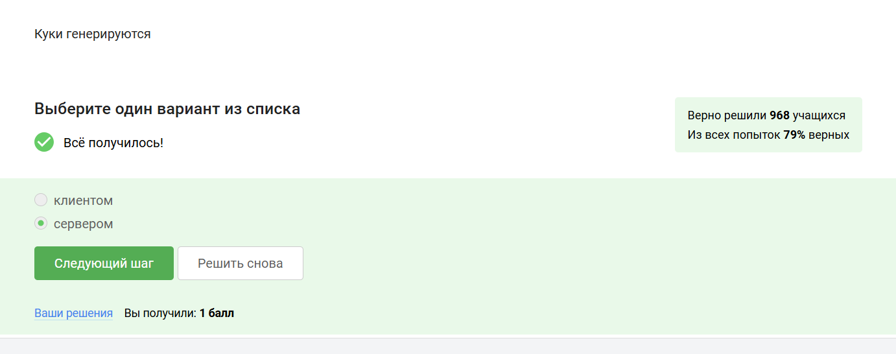

---
## Front matter
title: "Внешний курс. Блок 1: Безопасность в сети"
subtitle: "Дисцеплина: Основы информационной безопасности"
author: "Неустроева Ирина Николаевна"

## Generic otions
lang: ru-RU
toc-title: "Содержание"

## Bibliography
bibliography: bib/cite.bib
csl: pandoc/csl/gost-r-7-0-5-2008-numeric.csl

## Pdf output format
toc: true # Table of contents
toc-depth: 2
lof: true # List of figures
lot: true # List of tables
fontsize: 12pt
linestretch: 1.5
papersize: a4
documentclass: scrreprt
## I18n polyglossia
polyglossia-lang:
  name: russian
  options:
	- spelling=modern
	- babelshorthands=true
polyglossia-otherlangs:
  name: english
## I18n babel
babel-lang: russian
babel-otherlangs: english
## Fonts
mainfont: PT Serif
romanfont: PT Serif
sansfont: PT Sans
monofont: PT Mono
mainfontoptions: Ligatures=TeX
romanfontoptions: Ligatures=TeX
sansfontoptions: Ligatures=TeX,Scale=MatchLowercase
monofontoptions: Scale=MatchLowercase,Scale=0.9
## Biblatex
biblatex: true
biblio-style: "gost-numeric"
biblatexoptions:
  - parentracker=true
  - backend=biber
  - hyperref=auto
  - language=auto
  - autolang=other*
  - citestyle=gost-numeric
## Pandoc-crossref LaTeX customization
figureTitle: "Рис."
tableTitle: "Таблица"
listingTitle: "Листинг"
lofTitle: "Список иллюстраций"
lotTitle: "Список таблиц"
lolTitle: "Листинги"
## Misc options
indent: true
header-includes:
  - \usepackage{indentfirst}
  - \usepackage{float} # keep figures where there are in the text
  - \floatplacement{figure}{H} # keep figures where there are in the text
---

# Цель работы
 
Выполненить контрольные задания первого блока "Безопасность в сети" внешнего курса "Основы кибербезопасности".

# Выполнение заданий блока "Основы Кибербезопасности"

## Как работает интернет: базовые сетевые протоколы

Протокол HTTP(S) протокол прикладного уровня, ответ на вопрос 1 - HTTPS (рис. [-@fig:001]).

{#fig:001 width=70%}

На транспортном уровне существует два примера протокола: первый - это TCP, в честь которого названа модель. (рис. [-@fig:002]).

{#fig:002 width=70%}

Т.к адрес состоит из большего набора чисел, а именно это 4 или 6 цифер от 0 до 255. В двух вариантах встречаются цифры больше 255, что неверно(рис. [-@fig:003]).

{#fig:003 width=70%}

Основная задача DNC это сопоставлять название ( доменное имя, с корекстым IP-адресом) с тем, где лежит этот сервер, этот сайт. (рис. [-@fig:004]).

{#fig:004 width=70%}

Классификация протоколов в модели TCP/IP:

- Прикладной уровень: HTTP, RTSP, FTP, DNS.

- Транспортный уровень: TCP, UDP, SCTP, DCCP.

- Сетевой  уровень: IP.

- Уровень сетевого доступа (Канальный) (Link Layer): Ethernet, IEEE 802.11, WLAN, SLIP, Token Ring, ATM и MPLS(рис. [-@fig:005]).

{#fig:005 width=70%}

Протокол http передает не зашифрованные данные, а протокол https уже будет передавать зашифрованные данные (рис. [-@fig:006]).

 https передает зашифрованные данные, поэтому  одна из фаз это передача данных, другая должна быть рукопожатием
 
 {#fig:006 width=70%}

TLS определяется и клиентом, и сервером, чтобы было возможно подключиться (рис. [-@fig:007]).

{#fig:007 width=70%}

TLS определяется клиентом и сервером, чтобы возможно было подключиться (рис. [-@fig:008]).

{#fig:008 width=70%}

Фаза рукопожатия вкючает в себя: 

- выбор параметров, протоколов
- аутентификация (как минимум, сервера)
- формируется общий секретный ключ K 

Следовательно вариант с шифрованием лишний (рис. [-@fig:009]).

{#fig:009 width=70%}

## Персонализация сети

Куки хранят в себе список параметров и их значений. Этими параметрами могут быть id пользователя, id сессии, тип браузера и некоторые действия пользователей(рис. [-@fig:010]).

{#fig:010 width=70%}

Куки не делают соединение надежным (рис. [-@fig:011]).

{#fig:011 width=70%}

Куки генерируются сервером(рис. [-@fig:012]).

{#fig:012 width=70%}

Куки бывают сессионные, удаляются при закрытии окна браузера (рис. [-@fig:013]).

{#fig:013 width=70%}

## Браузер TOR. Анонимизация

В луковой модели маршрутизации у нас тоже есть узлы. Они разделяются на охранный узел, промежуточный и выходной. В браузере Tor всегда есть три роутера, их не больше и не меньше (рис. [-@fig:014]).

{#fig:014 width=70%}

IP-адрес не должен быть известен охранному и промежуточному узлам (рис. [-@fig:015]).

{#fig:015 width=70%}

В анонимных сетях, таких как Tor, общий секретный ключ для сквозного шифрования требует участия всех трех типов узлов: охранного, промежуточного и выходного. Охранный узел сам по себе не обеспечивает генерацию ключа. Каждый узел вносит свой вклад в криптографический протокол (например, Diffie-Hellman), обеспечивая анонимность и защиту от перехвата. (рис. [-@fig:016]).

{#fig:016 width=70%}

Для получения пакетов не нужно использовать TOR. TOR — это технология, которая позволяет с некоторым успехом скрыть личность человека в интернете.(рис. [-@fig:017]).

{#fig:017 width=70%}

## Беспроводные сети Wi-fi

WiFi - это технология беспроводной локальной сети, она основана на стандарте IEEE 802.11 (рис. [-@fig:018]).

{#fig:018 width=70%}

WiFi работает на самом нижнем канальном уровне (рис. [-@fig:019]).

{#fig:019 width=70%}

WEP - устаревший и небезопасный метод шифрования WiFi из-за короткой длины ключа (40 бит), что делает его легко взламываемым. Использовать WEP категорически не рекомендуется.(рис. [-@fig:020]).

{#fig:020 width=70%}

Безопасность WiFi подразумевает защиту передачи данных между устройством (телефон, компьютер) и роутером (подключенным к интернету), осуществляемую с помощью шифрования и аутентификации.(рис. [-@fig:021]).

{#fig:021 width=70%}

WPA2 Personal предназначен для домашнего использования, а WPA2 Enterprise - для коммерческих организаций. (рис. [-@fig:022]).

{#fig:022 width=70%}

# Выводы

В результате выполнения блока "Безопасность в сети" я узнала, как работают сетевые пратаколы, куки-файлы, сети вайфай и для чего нужен браузер Tor.

::: {#refs}
:::
