---
## Front matter
lang: ru-RU
title: "Внешний курс. Блок 2: Защита ПК/телефона"
author:
  - Неустроева И.Н.
institute:
  - Российский университет дружбы народов, Москва, Россия
## i18n babel
babel-lang: russian
babel-otherlangs: english

## Formatting pdf
toc: false
toc-title: Содержание
slide_level: 2
aspectratio: 169
section-titles: true
theme: metropolis
header-includes:
 - \metroset{progressbar=frametitle,sectionpage=progressbar,numbering=fraction}
 - '\makeatletter'
 - '\beamer@ignorenonframefalse'
 - '\makeatother'
 
 ## Fonts
mainfont: PT Serif
romanfont: PT Serif
sansfont: PT Sans
monofont: PT Mono
mainfontoptions: Ligatures=TeX
romanfontoptions: Ligatures=TeX
sansfontoptions: Ligatures=TeX,Scale=MatchLowercase
monofontoptions: Scale=MatchLowercase,Scale=0.9
 
---

# Информация

## Докладчик

:::::::::::::: {.columns align=center}
::: {.column width="70%"}

  * Неустроева Ирина Николаевна
  * студентка группы НБИ 02-23
  * Российский университет дружбы народов
:::
::::::::::::::

## Преподаватель

:::::::::::::: {.columns align=center}
::: {.column width="70%"}

  * Кулябов Дмитрий Сергеевич
  * д.ф.-м.н., профессор
  * профессор кафедры прикладной информатики и теории вероятностей
  * Российский университет дружбы народов
:::
::::::::::::::

# Вводная часть

## Цели и задачи

Выполненить контрольные задания второго блока "Защита ПК/телефона" внешнего курса "Основы кибербезопасности".

## Материалы и методы

Интернет-ресурсы

# Основная часть 

## Шифрование диска Вопрос 3.1.1

Шифровать нужно не только жесткий диск, но и загрузочный сектор диска. Ответ-можно

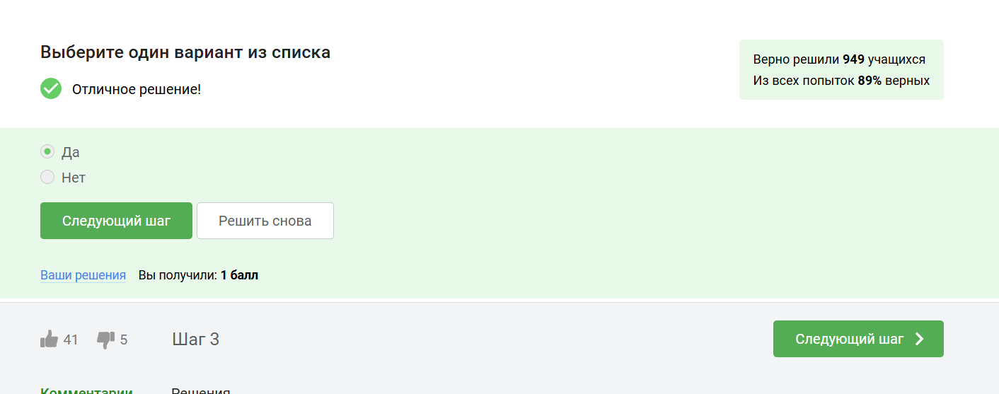

## Вопрос 3.1.2

Шифрование диска основано на симметричном шифровании

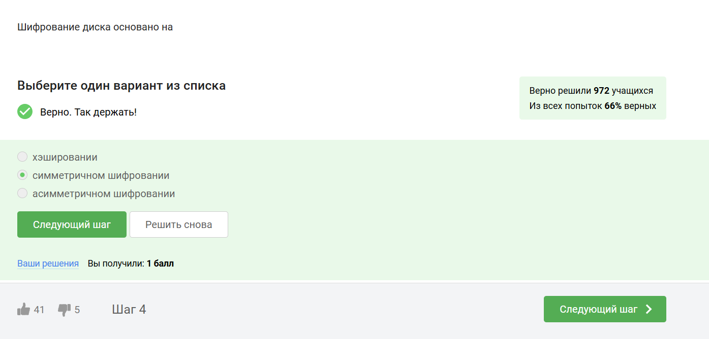

## Вопрос 3.1.3

Популярные ОС имеют встроенные инструменты для шифрования дисков: Windows (Bitlocker), Linux (LUKS), MacOS (FileVault). Также доступны бесплатные опенсорсные альтернативы, такие как Veracrypt и PGPDisk.

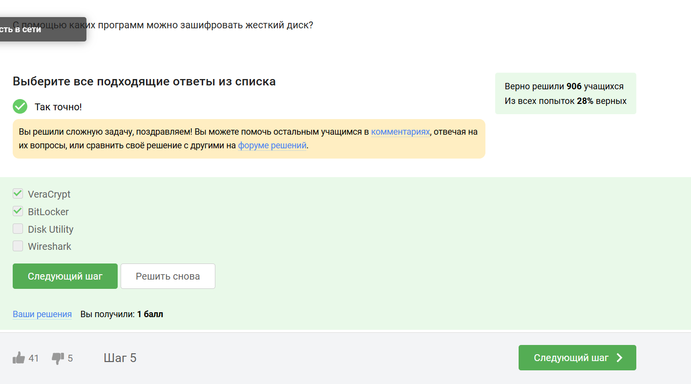

## Вопрос 3.2.1 Пароли

Стойкий пароль содержит цифры стройчные и заглавные буквы и специальные символы. Это усложняет перебор пароля

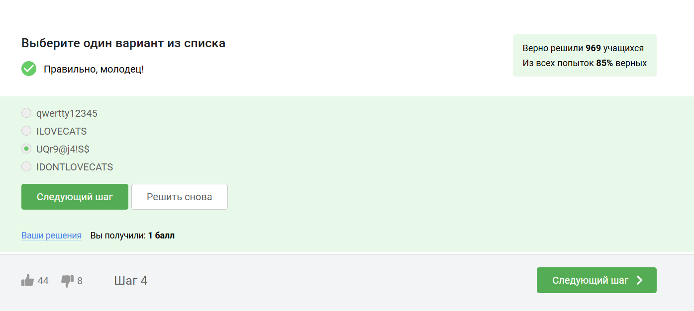

## [Вопрос 3.2.2

Безопасно хранить пароли нужно только в месенджерах 

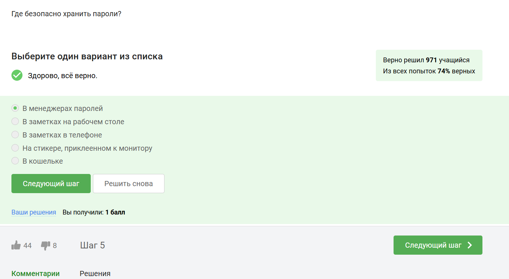

## Вопрос 3.2.3

Капча - тест для определения, кто общается с веб-сервисом, человек или бот

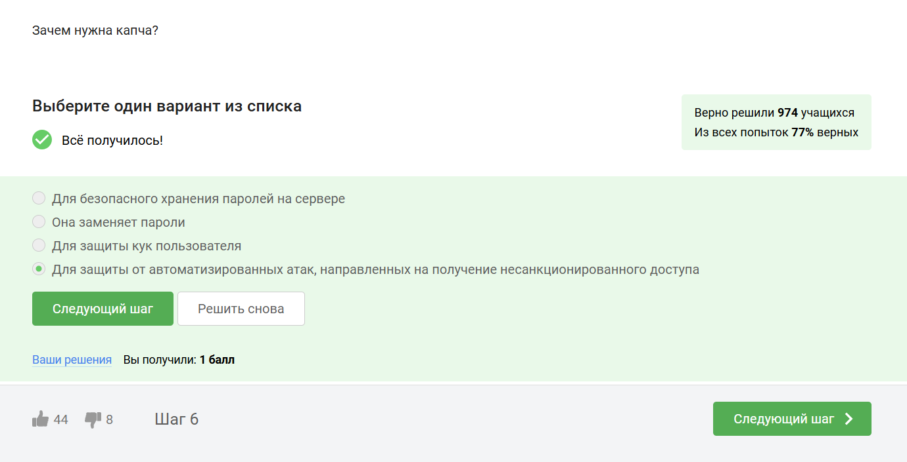

## Вопрос 3.2.4

В целях безопасности пароли хранят не в открвтом виде, а в виде хешей

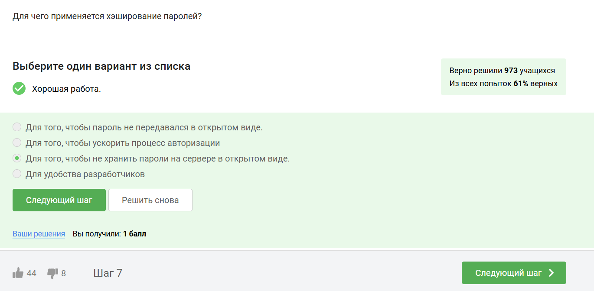

## Вопрос 3.2.5

Соль - это метод защиты слабых паролей. Сервер добавляет соль к паролю пользователя. Это делает взлом слабых паролей сложнее 

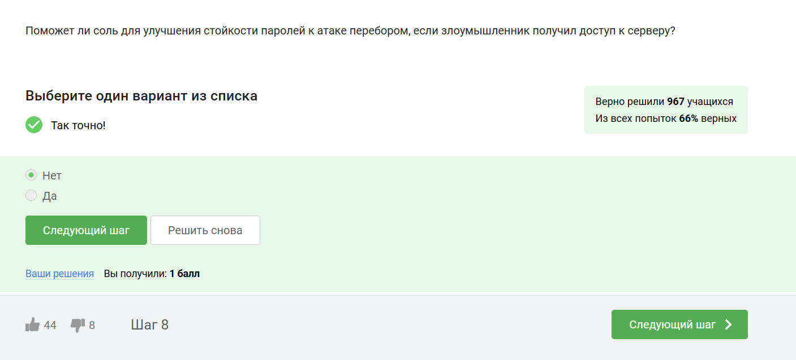

##  Вопрос 3.2.6

Для безопасности нужно использовать длинные, сложные пароли, регулярно обновлять и хранить пароли в месенджерах паролей.

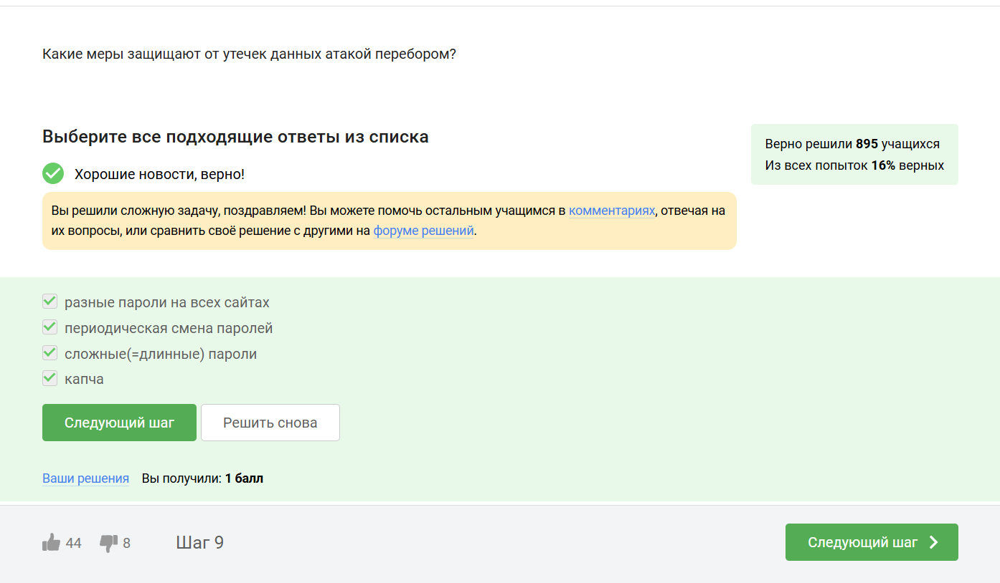

## Фишинг Вопрос 3.3.1

Пример фишинга - эта маскировка под известные веб-сайты только с другим доменным именем

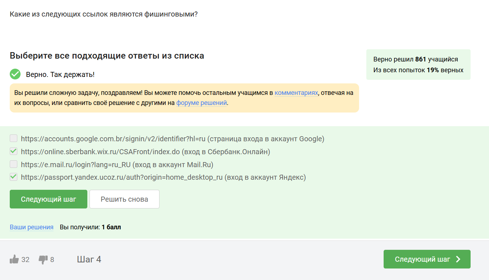

## Вопрос 3.3.2

Может фишинговое письмо прийти и от знакомого

##  Вирусы Вопрос 3.4.1

Спуфинг - это подмена адреса отправителя в имейлах

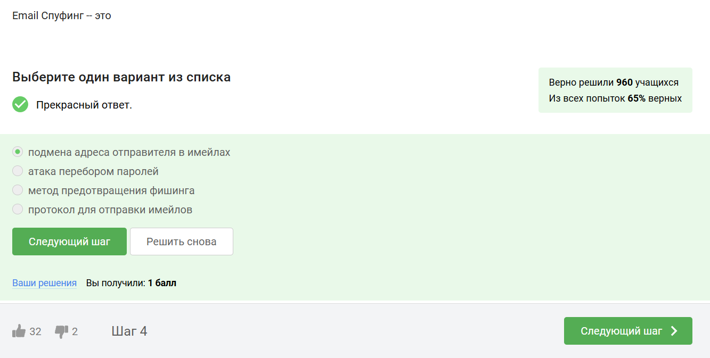

## Вопрос 3.4.2

Троян маскируется под обыкновенную безобидную программу, при запуске которой вирус легко проникает в ваш компьютер и поражает его

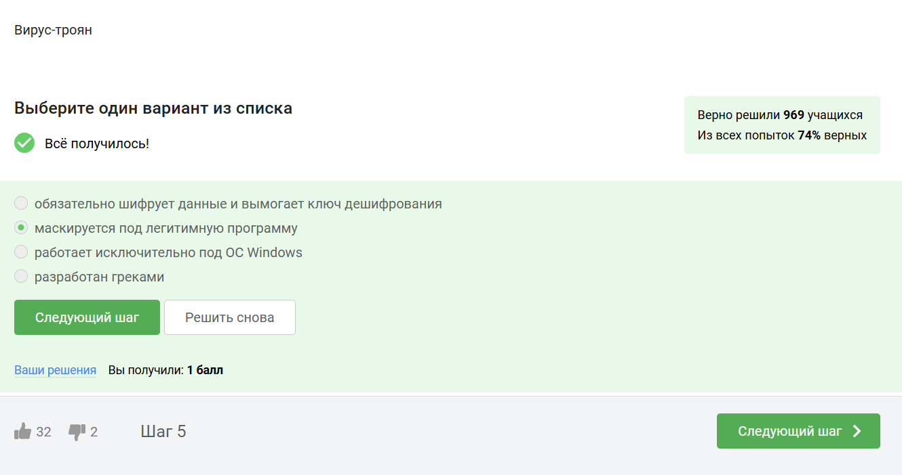

## Безопасность мессенджеров Вопрос 3.5.1

При генерации первого сообщения отправителем формируется ключ шифрования

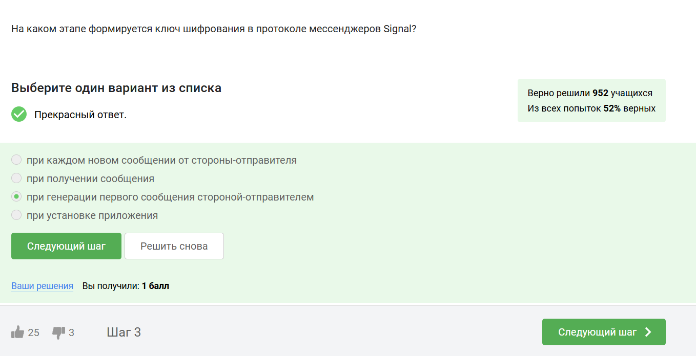

## Вопрос 3.5.2

Сквозное шифрование позволяет передавать сообщения между пользователями (Алиса и Боб) так, что сервер знает только адресата, но не может прочитать содержимое. Алиса шифрует сообщение, сервер передает шифрованный текст Бобу, а Боб его расшифровывает. Сервер не имеет доступа к ключам или открытому тексту сообщения.

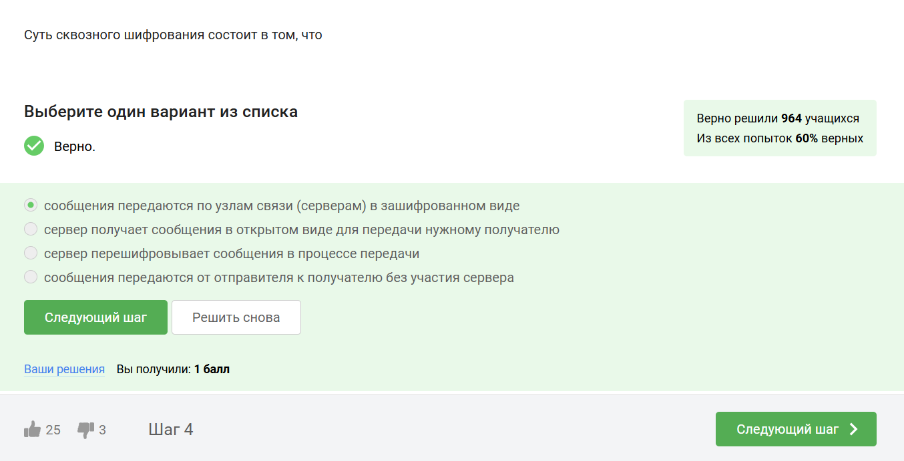

## Вывод

В результате я сделала второй блок курса "Основы кибербезопасности". Узнала правила составления и хранения паролей, поняла много нового о вирусах и мерах безопасности против них.

:::

