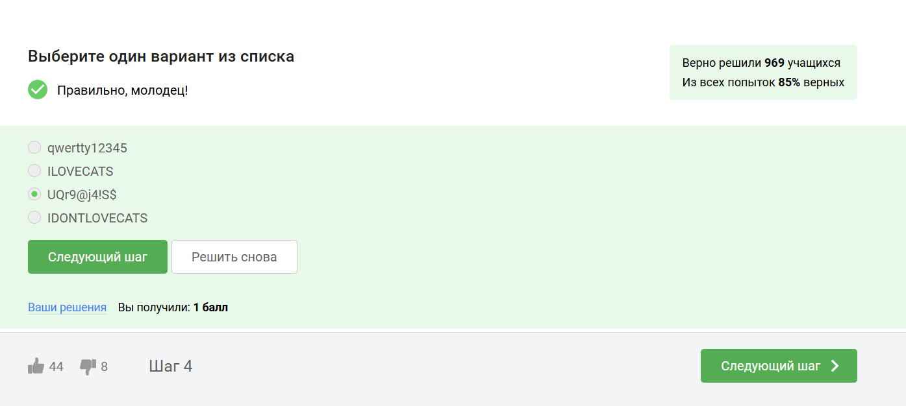
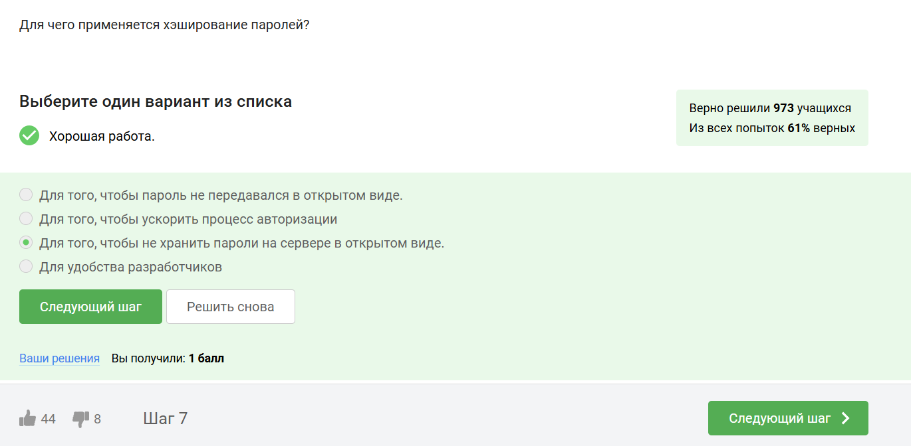
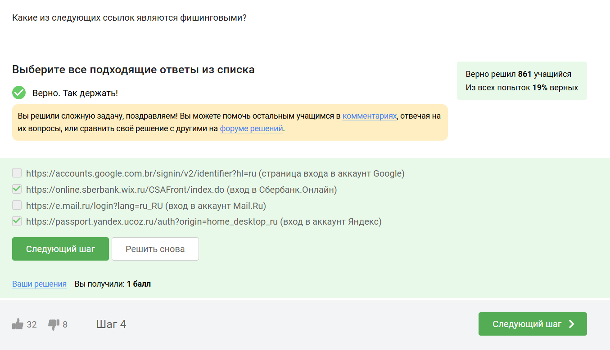
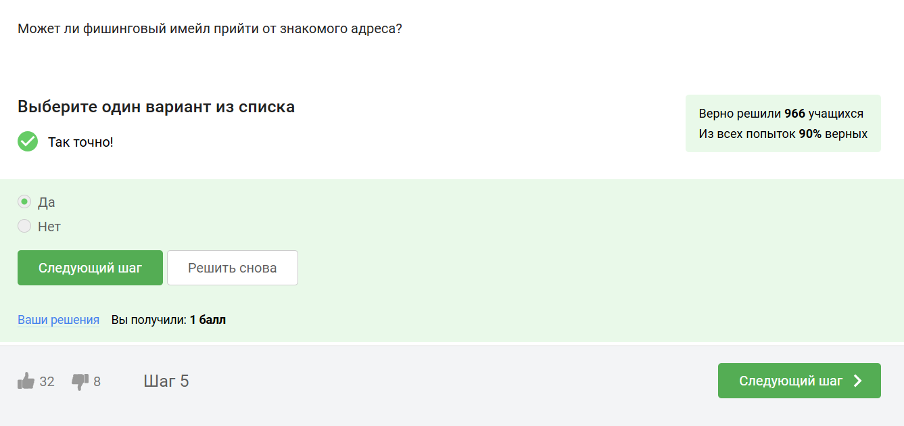
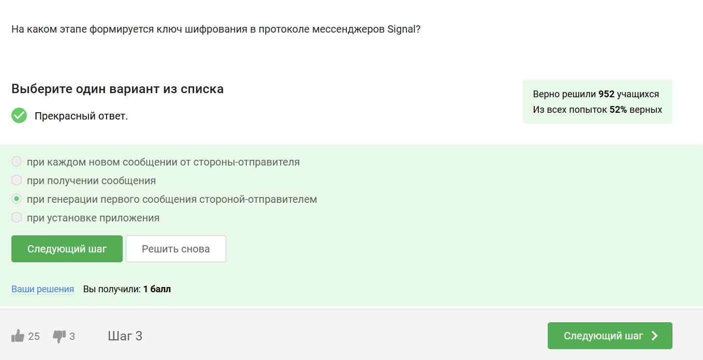

---
## Front matter
title: "Внешний курс. Блок 2: Защита ПК/телефона"
subtitle: "Дисцеплина: Основы информационной безопасности"
author: "Неустроева Ирина Николаевна"

## Generic otions
lang: ru-RU
toc-title: "Содержание"

## Bibliography
bibliography: bib/cite.bib
csl: pandoc/csl/gost-r-7-0-5-2008-numeric.csl

## Pdf output format
toc: true # Table of contents
toc-depth: 2
lof: true # List of figures
lot: true # List of tables
fontsize: 12pt
linestretch: 1.5
papersize: a4
documentclass: scrreprt
## I18n polyglossia
polyglossia-lang:
  name: russian
  options:
	- spelling=modern
	- babelshorthands=true
polyglossia-otherlangs:
  name: english
## I18n babel
babel-lang: russian
babel-otherlangs: english
## Fonts
mainfont: PT Serif
romanfont: PT Serif
sansfont: PT Sans
monofont: PT Mono
mainfontoptions: Ligatures=TeX
romanfontoptions: Ligatures=TeX
sansfontoptions: Ligatures=TeX,Scale=MatchLowercase
monofontoptions: Scale=MatchLowercase,Scale=0.9
## Biblatex
biblatex: true
biblio-style: "gost-numeric"
biblatexoptions:
  - parentracker=true
  - backend=biber
  - hyperref=auto
  - language=auto
  - autolang=other*
  - citestyle=gost-numeric
## Pandoc-crossref LaTeX customization
figureTitle: "Рис."
tableTitle: "Таблица"
listingTitle: "Листинг"
lofTitle: "Список иллюстраций"
lotTitle: "Список таблиц"
lolTitle: "Листинги"
## Misc options
indent: true
header-includes:
  - \usepackage{indentfirst}
  - \usepackage{float} # keep figures where there are in the text
  - \floatplacement{figure}{H} # keep figures where there are in the text
---

# Цель работы
 
Выполненить контрольные задания второго блока "Защита ПК/телефона" внешнего курса "Основы кибербезопасности".

# Выполнение заданий блока "Основы Кибербезопасности"

## Шифрование диска

Шифровать нужно не только жесткий диск, но и загрузочный сектор диска. Ответ-можно (рис. [-@fig:001]).

{#fig:001 width=70%}

Шифрование диска основано на симметричном шифровании (рис. [-@fig:002]).

{#fig:002 width=70%}

Популярные ОС имеют встроенные инструменты для шифрования дисков: Windows (Bitlocker), Linux (LUKS), MacOS (FileVault). Также доступны бесплатные опенсорсные альтернативы, такие как Veracrypt и PGPDisk. (рис. [-@fig:003]).

{#fig:003 width=70%}

## Пароли

Стойкий пароль содержит цифры стройчные и заглавные буквы и специальные символы. Это усложняет перебор пароля (рис. [-@fig:004]).

{#fig:004 width=70%}

Безопасно хранить пароли нужно только в месенджерах  (рис. [-@fig:005]).

{#fig:005 width=70%}

Капча - тест для определения, кто общается с веб-сервисом, человек или бот(рис. [-@fig:006]).

{#fig:006 width=70%}

В целях безопасности пароли хранят не в открвтом виде, а в виде хешей (рис. [-@fig:007]).

{#fig:007 width=70%}

Соль - это метод защиты слабых паролей. Сервер добавляет соль к паролю пользователя. Это делает взлом слабых паролей сложнее (рис. [-@fig:008]).

{#fig:008 width=70%}

Для безопасности нужно использовать длинные, сложные пароли, регулярно обновлять и хранить пароли в месенджерах паролей. (рис. [-@fig:009]).

{#fig:009 width=70%}

##  Фишинг

Пример фишинга - эта маскировка под известные веб-сайты только с другим доменным именем (рис. [-@fig:010]).

{#fig:010 width=70%}

Может фишинговое письмо прийти и от знакомого(рис. [-@fig:011]).

{#fig:011 width=70%}

## Вирусы. 

Спуфинг - это подмена адреса отправителя в имейлах (рис. [-@fig:012]).

{#fig:012 width=70%}

 Троян маскируется под обыкновенную безобидную программу, при запуске которой вирус легко проникает в ваш компьютер и поражает его(рис. [-@fig:013]).

{#fig:013 width=70%}

## Безопасность мессенджеров

При генерации первого сообщения отправителем формируется ключ шифрования (рис. [-@fig:014]).

{#fig:014 width=70%}

Сквозное шифрование позволяет передавать сообщения между пользователями (Алиса и Боб) так, что сервер знает только адресата, но не может прочитать содержимое. Алиса шифрует сообщение, сервер передает шифрованный текст Бобу, а Боб его расшифровывает. Сервер не имеет доступа к ключам или открытому тексту сообщения. (рис. [-@fig:015]).

{#fig:015 width=70%}

# Выводы

В результате я сделала второй блок курса "Основы кибербезопасности". Узнала правила составления и хранения паролей, поняла много нового о вирусах и мерах безопасности против них.

::: {#refs}
:::
