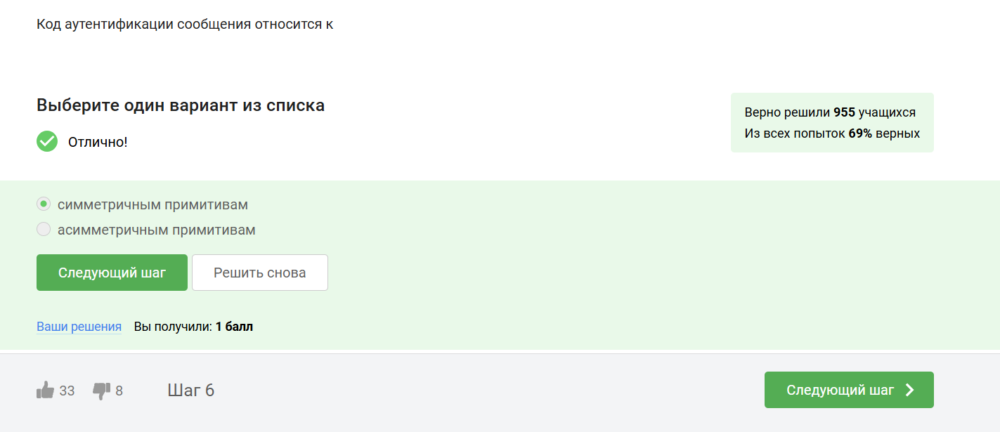

---
## Front matter
lang: ru-RU
title: "Внешний курс. Блок 3: Криптография на практике"
author:
  - Неустроева И.Н.
institute:
  - Российский университет дружбы народов, Москва, Россия
## i18n babel
babel-lang: russian
babel-otherlangs: english

## Formatting pdf
toc: false
toc-title: Содержание
slide_level: 2
aspectratio: 169
section-titles: true
theme: metropolis
header-includes:
 - \metroset{progressbar=frametitle,sectionpage=progressbar,numbering=fraction}
 - '\makeatletter'
 - '\beamer@ignorenonframefalse'
 - '\makeatother'
 
 ## Fonts
mainfont: PT Serif
romanfont: PT Serif
sansfont: PT Sans
monofont: PT Mono
mainfontoptions: Ligatures=TeX
romanfontoptions: Ligatures=TeX
sansfontoptions: Ligatures=TeX,Scale=MatchLowercase
monofontoptions: Scale=MatchLowercase,Scale=0.9
 
---

# Информация

## Докладчик

:::::::::::::: {.columns align=center}
::: {.column width="70%"}

  * Неустроева Ирина Николаевна
  * студентка группы НБИ 02-23
  * Российский университет дружбы народов
:::
::::::::::::::

## Преподаватель

:::::::::::::: {.columns align=center}
::: {.column width="70%"}

  * Кулябов Дмитрий Сергеевич
  * д.ф.-м.н., профессор
  * профессор кафедры прикладной информатики и теории вероятностей
  * Российский университет дружбы народов
:::
::::::::::::::

# Вводная часть

## Цели и задачи

Выполненить контрольные задания третьего блока "Криптография на практи" внешнего курса "Основы кибербезопасности".

## Материалы и методы

Интернет-ресурсы

# Основная часть 

## Выполнение заданий блока "Основы Кибербезопасности"

В асимметричной криптографии у каждой из старон есть пара ключей: открытый и секретный ключ

## Выполнение заданий блока "Основы Кибербезопасности"

Криптографическая хэш-функция обладает важным свойством стойкости к коллизиям, что означает, что крайне сложно найти два разных входа, которые дают одинаковый хэш. Она принимает произвольный объем данных и выдает фиксированную строку заданной длины (например, n). Обычно функция сжимает данные, преобразуя большой набор информации в небольшое значение

## Выполнение заданий блока "Основы Кибербезопасности"

Отмечены алгоритмы цифровой подписи

## Выполнение заданий блока "Основы Кибербезопасности"

Код аутентификации сообщения (MAC) относится к симметричным примитивам, поскольку для его генерации и проверки используется общий секретный ключ, известный только отправителю и получателю, что обеспечивает целостность и аутентичность данных

## Выполнение заданий блока "Основы Кибербезопасности"

Чтобы ответить на данный вопрос использую определение Диффи-Хэллмана

## Выполнение заданий блока  Цифровая подпись

По определению цифровой подписи протокол ЭЦП относиться к протоколам с публичным ключом

## Выполнение заданий блока  Цифровая подпись

Каждая машина процедуру верификации, которая берет на вход само обновление, подпись и открытый ключ разработчика

## Выполнение заданий блока  Цифровая подпись

Цифровая подпись обеспечивает три ключевых функции: 

1. Целостность сообщения — изменения в сообщении приводят к некорректной проверке подписи.

2. Аутентификация — позволяет установить, что подпись принадлежит конкретному владельцу.

3. Неотказ от авторства — подписавший не может отказаться от своей подписи.

Однако, если секретный ключ украден, безопасность подписи подрывается, и она не обеспечивает конфиденциальности

##  Выполнение заданий блока  Цифровая подпись

Усиленная квалифицированная подпись (УКЭП) имеет юридическую силу и равнозначна рукописной подписи. Для её получения необходимо обратиться в аккредитованный сертификационный центр с паспортом и другими данными.

## Выполнение заданий блока  Цифровая подпись

Сертификат подписывается с помощью электронной подписи уже доверенной стороной, удостоверяющим центром.

## Выполнение заданий блока Электронные платежи

На данный момент существуют такие платежные системы, как: Visa, MasterCard, МИР

## Выполнение заданий блока Электронные платежи

Основные категории вещей, которые мы можем использовать для доказательства своей идентичности:

1. Знание: Это что-то, что я знаю, например, пароль, PIN-код или секретный код для онлайн-платежей.

   
2. Владение: В онлайн-платежах используется второй фактор — это то, чем я владею, например, телефон, на который приходит код для подтверждения.
 
 
3. Свойства: Биометрические данные, такие как отпечаток пальца или сетчатка глаза, служат третьим фактором аутентификации.

4. Локация: Четвертый фактор аутентификации — это место, откуда осуществляется доступ, что также может быть учтено при проверке идентичности.

## Выполнение заданий блока Блокчейн

Proof-of-Work (PoW) — это способ, который используется в блокчейне для подтверждения транзакций и создания новых блоков. В этом процессе майнеры (люди, которые занимаются добычей криптовалюты) соревнуются друг с другом за завершение транзакций в сети и за вознаграждение

Когда люди отправляют друг другу цифровые деньги, эти транзакции собираются в блоки и добавляются в общую базу данных, называемую блокчейном. Чтобы сделать сеть безопасной и защитить её от мошенничества, PoW требует много вычислительных ресурсов. Это значит, что для успешного участия в процессе нужно много мощных компьютеров

## Выполнение заданий блока Блокчейн

В основе любого блокчейна, включая биткоин, лежит консенсус — публичная структура данных (ledger), содержащая историю всех транзакций. Консенсус обеспечивает четыре ключевых свойства:

1. Постоянство: Добавленные данные не могут быть удалены.

2. Согласованность: Все участники видят и согласны с одними и теми же данными, за исключением последних изменений.

3. Живучесть: Возможность добавления новых транзакций в любое время.

4. Открытость: Любой желающий может стать участником блокчейна.

Эти свойства обеспечивают надежность и безопасность системы.

## Выполнение заданий блока Блокчейн

В блокчейне у каждого из трех участников есть секретный ключ, который они используют для подтверждения транзакций. Этот секретный ключ позволяет создавать цифровую подпись, которая служит доказательством того, что транзакция была инициирована конкретным участником. Цифровая подпись основана на паре ключей — секретном и открытом. Секретный ключ используется для подписания транзакции, а открытый ключ позволяет другим участникам проверить подлинность этой подписи. Таким образом, цифровая подпись обеспечивает безопасность и аутентичность транзакций в блокчейне.

## Вывод

В результате 3 этапа я узнала много нового о криптографии, цифровых подписях и технологиях бкокчейна. Выяснила, как обеспечивается безопасность транзакций. 

:::

