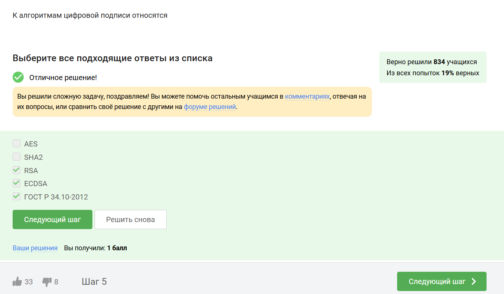
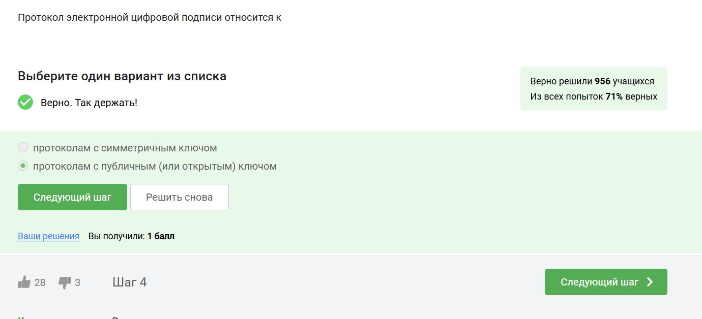
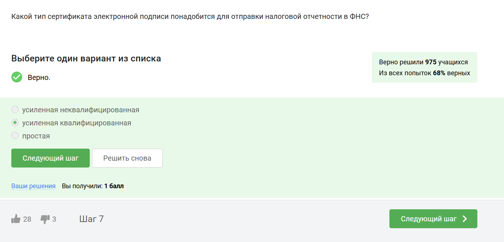
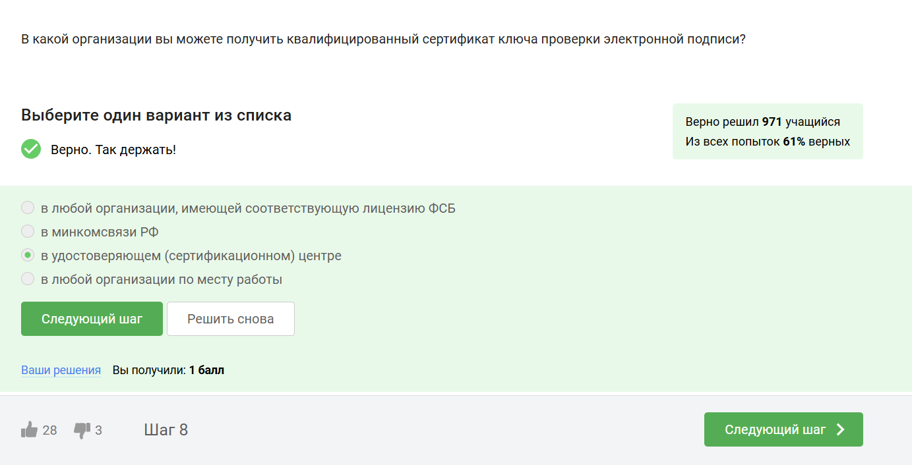
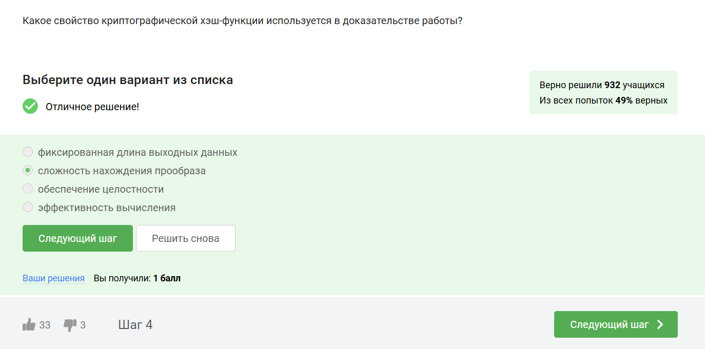

---
## Front matter
title: "Внешний курс. Блок 3: Криптография на практике"
subtitle: "Дисцеплина: Основы информационной безопасности"
author: "Неустроева Ирина Николаевна"

## Generic otions
lang: ru-RU
toc-title: "Содержание"

## Bibliography
bibliography: bib/cite.bib
csl: pandoc/csl/gost-r-7-0-5-2008-numeric.csl

## Pdf output format
toc: true # Table of contents
toc-depth: 2
lof: true # List of figures
lot: true # List of tables
fontsize: 12pt
linestretch: 1.5
papersize: a4
documentclass: scrreprt
## I18n polyglossia
polyglossia-lang:
  name: russian
  options:
	- spelling=modern
	- babelshorthands=true
polyglossia-otherlangs:
  name: english
## I18n babel
babel-lang: russian
babel-otherlangs: english
## Fonts
mainfont: PT Serif
romanfont: PT Serif
sansfont: PT Sans
monofont: PT Mono
mainfontoptions: Ligatures=TeX
romanfontoptions: Ligatures=TeX
sansfontoptions: Ligatures=TeX,Scale=MatchLowercase
monofontoptions: Scale=MatchLowercase,Scale=0.9
## Biblatex
biblatex: true
biblio-style: "gost-numeric"
biblatexoptions:
  - parentracker=true
  - backend=biber
  - hyperref=auto
  - language=auto
  - autolang=other*
  - citestyle=gost-numeric
## Pandoc-crossref LaTeX customization
figureTitle: "Рис."
tableTitle: "Таблица"
listingTitle: "Листинг"
lofTitle: "Список иллюстраций"
lotTitle: "Список таблиц"
lolTitle: "Листинги"
## Misc options
indent: true
header-includes:
  - \usepackage{indentfirst}
  - \usepackage{float} # keep figures where there are in the text
  - \floatplacement{figure}{H} # keep figures where there are in the text
---

# Цель работы
 
Выполненить контрольные задания третьего блока "Криптография на практи" внешнего курса "Основы кибербезопасности".

# Выполнение заданий блока "Основы Кибербезопасности"

## Введение в криптографию

В асимметричной криптографии у каждой из старон есть пара ключей: открытый и секретный ключ (рис. [-@fig:001]).

{#fig:001 width=70%}

Криптографическая хэш-функция обладает важным свойством стойкости к коллизиям, что означает, что крайне сложно найти два разных входа, которые дают одинаковый хэш. Она принимает произвольный объем данных и выдает фиксированную строку заданной длины (например, n). Обычно функция сжимает данные, преобразуя большой набор информации в небольшое значение. (рис. [-@fig:002]).

{#fig:002 width=70%}

Отмечены алгоритмы цифровой подписи (рис. [-@fig:003]).

{#fig:003 width=70%}

Код аутентификации сообщения (MAC) относится к симметричным примитивам, поскольку для его генерации и проверки используется общий секретный ключ, известный только отправителю и получателю, что обеспечивает целостность и аутентичность данных.(рис. [-@fig:004]).

{#fig:004 width=70%}

Чтобы ответить на данный вопрос использую определение Диффи-Хэллмана (рис. [-@fig:005]).

{#fig:005 width=70%}

## Цифровая подпись

По определению цифровой подписи протокол ЭЦП относиться к протоколам с публичным ключом (рис. [-@fig:006]).

{#fig:006 width=70%}

Каждая машина процедуру верификации, которая берет на вход само обновление, подпись и открытый ключ разработчика (рис. [-@fig:007]).

{#fig:007 width=70%}

Цифровая подпись обеспечивает три ключевых функции: 

1. Целостность сообщения — изменения в сообщении приводят к некорректной проверке подписи.

2. Аутентификация — позволяет установить, что подпись принадлежит конкретному владельцу.

3. Неотказ от авторства — подписавший не может отказаться от своей подписи.

Однако, если секретный ключ украден, безопасность подписи подрывается, и она не обеспечивает конфиденциальности.(рис. [-@fig:008]).

{#fig:008 width=70%}

Усиленная квалифицированная подпись (УКЭП) имеет юридическую силу и равнозначна рукописной подписи. Для её получения необходимо обратиться в аккредитованный сертификационный центр с паспортом и другими данными.  (рис. [-@fig:009]).

{#fig:009 width=70%}

Сертификат подписывается с помощью электронной подписи уже доверенной стороной, удостоверяющим центром. (рис. [-@fig:010]).

{#fig:010 width=70%}

##  Электронные платежи

На данный момент существуют такие платежные системы, как: Visa, MasterCard, МИР (рис. [-@fig:011]).

{#fig:011 width=70%}

Основные категории вещей, которые мы можем использовать для доказательства своей идентичности:

1. Знание: Это что-то, что я знаю, например, пароль, PIN-код или секретный код для онлайн-платежей.

   
2. Владение: В онлайн-платежах используется второй фактор — это то, чем я владею, например, телефон, на который приходит код для подтверждения.
 
 
3. Свойства: Биометрические данные, такие как отпечаток пальца или сетчатка глаза, служат третьим фактором аутентификации.

4. Локация: Четвертый фактор аутентификации — это место, откуда осуществляется доступ, что также может быть учтено при проверке идентичности. (рис. [-@fig:012]).

{#fig:012 width=70%}

При онлайн платежах используется многофакторная аутентификация банком-эмитентом (выпустившим карту), чтобы удостовериться, что транзакцию совершает именно владелец карты или счета, а не злоумышленник(рис. [-@fig:013]).

{#fig:013 width=70%}

## Блокчейн

Proof-of-Work (PoW) — это способ, который используется в блокчейне для подтверждения транзакций и создания новых блоков. В этом процессе майнеры (люди, которые занимаются добычей криптовалюты) соревнуются друг с другом за завершение транзакций в сети и за вознаграждение

Когда люди отправляют друг другу цифровые деньги, эти транзакции собираются в блоки и добавляются в общую базу данных, называемую блокчейном. Чтобы сделать сеть безопасной и защитить её от мошенничества, PoW требует много вычислительных ресурсов. Это значит, что для успешного участия в процессе нужно много мощных компьютеров.(рис. [-@fig:014]).

{#fig:014 width=70%}

В основе любого блокчейна, включая биткоин, лежит консенсус — публичная структура данных (ledger), содержащая историю всех транзакций. Консенсус обеспечивает четыре ключевых свойства:

1. Постоянство: Добавленные данные не могут быть удалены.

2. Согласованность: Все участники видят и согласны с одними и теми же данными, за исключением последних изменений.

3. Живучесть: Возможность добавления новых транзакций в любое время.

4. Открытость: Любой желающий может стать участником блокчейна.

Эти свойства обеспечивают надежность и безопасность системы. (рис. [-@fig:015]).

{#fig:015 width=70%}

 В блокчейне у каждого из трех участников есть секретный ключ, который они используют для подтверждения транзакций. Этот секретный ключ позволяет создавать цифровую подпись, которая служит доказательством того, что транзакция была инициирована конкретным участником. Цифровая подпись основана на паре ключей — секретном и открытом. Секретный ключ используется для подписания транзакции, а открытый ключ позволяет другим участникам проверить подлинность этой подписи. Таким образом, цифровая подпись обеспечивает безопасность и аутентичность транзакций в блокчейне. (рис. [-@fig:016]).

{#fig:016 width=70%}

# Выводы

В результате 3 этапа я узнала много нового о криптографии, цифровых подписях и технологиях бкокчейна. Выяснила, как обеспечивается безопасность транзакций. 

::: {#refs}
:::
