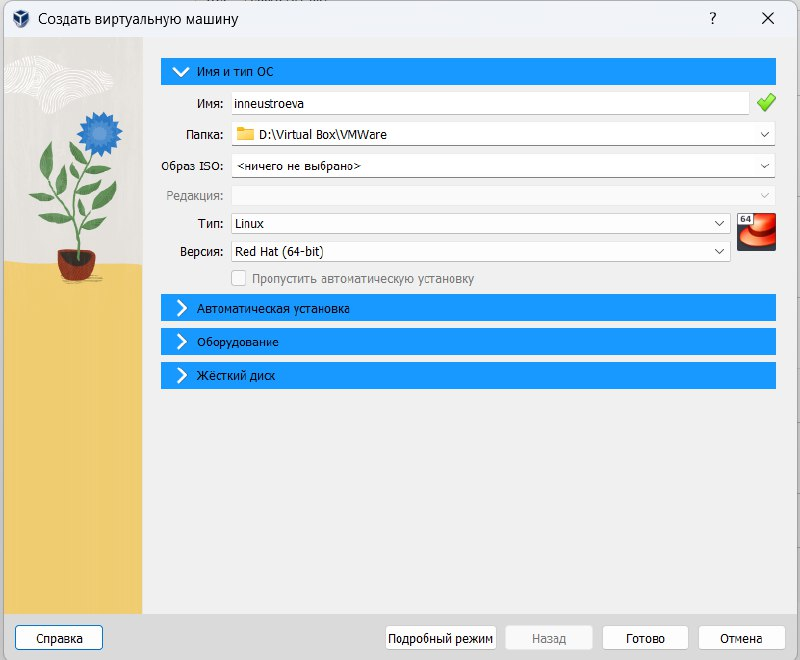

---
## Front matter
lang: ru-RU
title: Лабораторная работа 1
subtitle: 
author:
  - Неустроева.И.Н.
institute:
  - Российский университет дружбы народов, Москва, Россия
date: 20.02.25

## i18n babel
babel-lang: russian
babel-otherlangs: english

## Formatting pdf
toc: false
toc-title: Содержание
slide_level: 2
aspectratio: 169
section-titles: true
theme: metropolis
header-includes:
 - \metroset{progressbar=frametitle,sectionpage=progressbar,numbering=fraction}
 - '\makeatletter'
 - '\beamer@ignorenonframefalse'
 - '\makeatother'

## Fonts
mainfont: PT Serif
romanfont: PT Serif
sansfont: PT Sans
monofont: PT Mono
mainfontoptions: Ligatures=TeX
romanfontoptions: Ligatures=TeX
sansfontoptions: Ligatures=TeX,Scale=MatchLowercase
monofontoptions: Scale=MatchLowercase,Scale=0.9

---

# Информация

## Докладчик
:::::::::::::: {.columns align=center}
::: {.column width="70%"}

  * Неустроева Ирина Николаевна
  * студентка группы НБИ -02-23 
  * Российский университет дружбы народов 

:::
::: {.column width="30%"}

:::
::::::::::::::

# Вводная часть

## Цели и задачи

- Приобрести практические навыки по установки операционной системы linux, Roxcy на виртуальную машину, выполнить ее настройку 

## Материалы и методы

- Процессор `pandoc` для входного формата Markdown
- Результирующие форматы
	- `pdf`
	- `html`
- Автоматизация процесса создания: `Makefile`

# Создание презентации

## Создание виртуальной машины

Создали новую виртуальную машину, указали ее имя, тип операционной системы, размер основной памяти, задали конфигурацию жесткого диска и его размер.

{#fig:001 width=70%}

## Оптический диск

Добавили новый образ оптического диска в окне "Носители"

{#fig:002 width=70%}

## Запуск машины

Запустили виртуальную машину

{#fig:003 width=70%}

## Настройка установки операционной системы

Произвели настройку установки ОС и установили ее

{#fig:004 width=70%}

## Настройка установки операционной системы

Установили пароль для root и пользователя с правами администратора

{#fig:005 width=70%}

Включили сетевое соединение и в качестве имени узла указали: inneustroeva.localdomain

## Настройка установки операционной системы

{#fig:006 width=70%}

## Домашнее задание

Использовали команду grep, чтобы найти Версию ядра Линукс 

{#fig:007 width=70%}

## Домашнее задание

Использовали команду grep, чтобы найти Частоту процессора

{#fig:008 width=70%}

## Домашнее задание

Использовали команду grep, чтобы найти Модель процессора

{#fig:009 width=70%}

## Домашнее задание

Использовали команду grep, чтобы найти Объем доступной оперативной

{#fig:010 width=70%}

## Домашнее задание

Использовали команду grep, чтобы найти Тип гипервизора

{#fig:011 width=70%}

## Домашнее задание

Использовали команду grep, чтобы найти Тип файловый системы корневого раздела и последовательность матирования файловой сисстемы

{#fig:012 width=70%}

## Итог работы

- Я научилась устанавливать ОС на виртуальную машину и выполнять ее минимальную настройку. Вспомнила команду поиска grep и попрактиковаль ее использовать 

## Итоговый слайд

Установка ОС через виртуальную машину является хорошим навыком, который пригодится мне в будущем
