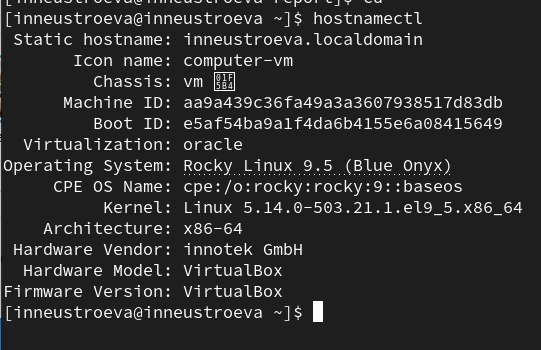
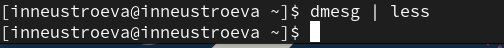

---
## Front matter
title: "Отчет по лабораторной работе № 1"
subtitle: "Установка и конфигурация операционных систем на виртуальную машину"
author: "Неустроева Ирина Николаевна"

## Generic otions
lang: ru-RU
toc-title: "Содержание"

## Bibliography
bibliography: bib/cite.bib
csl: pandoc/csl/gost-r-7-0-5-2008-numeric.csl

## Pdf output format
toc: true # Table of contents
toc-depth: 2
lof: true # List of figures
lot: true # List of tables
fontsize: 12pt
linestretch: 1.5
papersize: a4
documentclass: scrreprt
## I18n polyglossia
polyglossia-lang:
  name: russian
  options:
	- spelling=modern
	- babelshorthands=true
polyglossia-otherlangs:
  name: english
## I18n babel
babel-lang: russian
babel-otherlangs: english
## Fonts
mainfont: IBM Plex Serif
romanfont: IBM Plex Serif
sansfont: IBM Plex Sans
monofont: IBM Plex Mono
mathfont: STIX Two Math
mainfontoptions: Ligatures=Common,Ligatures=TeX,Scale=0.94
romanfontoptions: Ligatures=Common,Ligatures=TeX,Scale=0.94
sansfontoptions: Ligatures=Common,Ligatures=TeX,Scale=MatchLowercase,Scale=0.94
monofontoptions: Scale=MatchLowercase,Scale=0.94,FakeStretch=0.9
mathfontoptions:
## Biblatex
biblatex: true
biblio-style: "gost-numeric"
biblatexoptions:
  - parentracker=true
  - backend=biber
  - hyperref=auto
  - language=auto
  - autolang=other*
  - citestyle=gost-numeric
## Pandoc-crossref LaTeX customization
figureTitle: "Рис."
tableTitle: "Таблица"
listingTitle: "Листинг"
lofTitle: "Список иллюстраций"
lotTitle: "Список таблиц"
lolTitle: "Листинги"
## Misc options
indent: true
header-includes:
  - \usepackage{indentfirst}
  - \usepackage{float} # keep figures where there are in the text
  - \floatplacement{figure}{H} # keep figures where there are in the text
---

# Цель работы

Приобретение практических навыков установки операционной системы на виртуальную машину, настройки минимальной необходимых для работы сервисов

# Задание

Установить на виртуальную машину Linux, Roxy, произвести ее минимальную настройку 

# Выполнение лабораторной работы

Создали новую виртуальную машину, указали ее имя, тип операционной системы, размер основной памяти, задали конфигурацию жесткого диска и его размер. (рис. [-@fig:001]).

![Настройка виртуальной машины] (image/1.jpg){#fig:001 width=70%}

Добавили новый образ оптического диска в окне "Носители". (рис. [-@fig:002]).

{#fig:002 width=70%}

Запустили виртуальную машину. (рис. [-@fig:003]).

{#fig:003 width=70%}

В разделе выбора прграмм указали в качестве базового окружения-Server with GUI, а в качестве дополнительного-Development tool. (рис. [-@fig:004]).

{#fig:004 width=70%}

Отключили KDUMP (рис. [-@fig:005]).

{#fig:005 width=70%}

Включили сетевое соединение и в качестве имени узла указали: inneustroeva.localdomain(рис. [-@fig:006]).

{#fig:006 width=70%}

Установили пароль для root и пользователя с правами администратора (рис. [-@fig:007]).(рис. [-@fig:008]).

{#fig:007 width=70%}

{#fig:008 width=70%}

После всех настроек, дополнительно настроили часовой пояс, раскладку клавиатуры, выбрали английский в качестве интерфейса. После нажали на кнопу, установить. 
(рис. [-@fig:009]).

{#fig:009 width=70%}

Подключили образ диска дополнений гостевой ОС (рис. [-@fig:010]).

{#fig:010 width=70%}

Проверели, что хост имя верное (рис. [-@fig:011]).

{#fig:011 width=70%}

# Домашнее задание

Посмотрели вывод команды dmsg (рис. [-@fig:012]).

{#fig:012 width=70%}

Использовали команду grep, чтобы найти Версию ядра Линукс (рис. [-@fig:013]).

{#fig:013 width=70%}

Использовали команду grep, чтобы найти Частоту процессора (рис. [-@fig:014]).

{#fig:014 width=70%}

Использовали команду grep, чтобы найти Модель процессора (рис. [-@fig:015]).

{#fig:015 width=70%}

Использовали команду grep, чтобы найти Объем доступной оперативной памяти (рис. [-@fig:016]).

{#fig:016 width=70%}

Использовали команду grep, чтобы найти Тип гипервизора (рис. [-@fig:017]).

{#fig:017 width=70%}

Использовали команду grep, чтобы найти Тип файловый системы корневого раздела и последовательность матирования файловой сисстемы (рис. [-@fig:018]).

{#fig:018 width=70%}

# Выводы

Приобрели практические навыки установки операционной системы на виртуальную машину, настроили необходимое для работы сервисов и выполнили домашнее задание.

# Список литературы{.unnumbered}

::: {#refs}
:::
